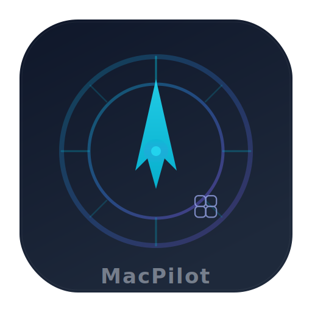

# 🤖 MacPilot

Programmatic macOS control for AI agents. Everything a human can do via keyboard + mouse, MacPilot can do programmatically.

Current version: **0.5.0**



## Quick Start

```bash
# Clone and build
git clone https://github.com/adhikjoshi/macpilot.git
cd macpilot
swift build -c release --disable-sandbox

# Build .app bundle (recommended — needed for Screen Recording permission)
bash scripts/build-app.sh

# Install to a location
cp -R MacPilot.app /path/to/your/tools/
```

### Permissions Required
1. **Accessibility** — System Settings → Privacy & Security → Accessibility → Add MacPilot.app
2. **Screen Recording** — System Settings → Privacy & Security → Screen Recording → Add MacPilot.app

### Verify Permissions
```bash
MacPilot ax-check --json
# Should show: "trusted": true
```

## ⚠️ Important: Screenshot Invocation

When calling MacPilot from a background process (e.g., AI agent, cron, daemon), **screenshots require the .app identity** for Screen Recording permission:

```bash
# ✅ For screenshots (uses .app's Screen Recording permission)
open -n -W -a /path/to/MacPilot.app --args screenshot --output /tmp/screen.png --json

# ✅ For all other commands (direct binary is fine)
MP=/path/to/MacPilot.app/Contents/MacOS/MacPilot
$MP window list --json
$MP keyboard type "hello" --json
$MP mouse click 100 200 --json
```

## Commands

All commands support `--json` for structured output. **35 command categories** with 80+ subcommands.

### Mouse
```bash
MacPilot click 100 200             # positional shorthand
MacPilot doubleclick 100 200
MacPilot rightclick 100 200
MacPilot move 300 300
MacPilot drag 100 200 300 400
MacPilot scroll up 5
MacPilot scroll down 10
```

### Keyboard
```bash
MacPilot type "Hello World" --json
MacPilot key "cmd+c" --json
MacPilot key return --json
MacPilot key "cmd+shift+3" --json
MacPilot keyboard type "text" --json        # alias
MacPilot keyboard key "ctrl+right" --json   # switch Space
```

**Alert sound detection** is enabled by default — if a keyboard command triggers an error alert sound, `alertSoundDetected: true` appears in JSON output. Disable with `--no-detect-errors`.

### Screenshot
```bash
MacPilot screenshot --output /tmp/screen.png --json
MacPilot screenshot --region 100,100,800,600 --output /tmp/region.png --json

# From background processes:
open -n -W -a MacPilot.app --args screenshot --output /tmp/screen.png --json
```

### App Management
```bash
MacPilot app list --json                     # list running apps
MacPilot app open Safari --json              # open by name
MacPilot app open com.apple.TextEdit --json  # open by bundle ID
MacPilot app frontmost --json                # get frontmost app
MacPilot app quit Safari --json              # graceful quit
MacPilot app quit Safari --force --json      # force quit
MacPilot app activate Safari --json          # bring to front
```

### Window Management
```bash
MacPilot window list --json
MacPilot window focus Safari --json
MacPilot window move Safari 100 100 --json
MacPilot window resize Safari 1200 800 --json
MacPilot window minimize Safari --json
MacPilot window fullscreen Safari --json
MacPilot window close Safari --json
```

### UI / Accessibility
```bash
MacPilot ui list --json                    # list UI elements
MacPilot ui find "Submit" --json           # find element by name
MacPilot ui click "Submit" --json          # click by accessibility label
MacPilot ui tree --depth 3 --json          # element hierarchy
MacPilot ui find-text "Search" --json      # search entire AX tree for text
MacPilot ui wait-for "Submit" --timeout 10 --json  # poll until element appears
```

### Chrome Browser
```bash
MacPilot chrome open-url "https://example.com" --json
MacPilot chrome new-tab "https://example.com" --json
MacPilot chrome list-tabs --json
MacPilot chrome close-tab --json           # close current tab (Cmd+W)
MacPilot chrome extensions --json          # open extensions page
MacPilot chrome dev-mode --json            # toggle developer mode
```

### Dialog / File Picker + Modal Detection
```bash
# File dialog navigation
MacPilot dialog navigate /tmp --json
MacPilot dialog select myfile.txt --json
MacPilot dialog file-open --json
MacPilot dialog file-save --json

# Modal dialog detection & handling (NEW in v0.5.0)
MacPilot dialog detect --json              # detect if modal dialog is showing
MacPilot dialog dismiss "Don't Save" --json  # dismiss by button name
MacPilot dialog auto-dismiss --json        # smart auto-dismiss (Don't Save > OK > Cancel)
```

### Chain Commands (multi-step automation)
```bash
MacPilot chain "cmd+l" "type:https://google.com" "return" --json
MacPilot chain "cmd+l" "type:url" "sleep:500" "return" --delay 200 --json

# Syntax: "key_name", "cmd+key", "type:text", "sleep:ms"
```

### Clipboard
```bash
MacPilot clipboard get --json
MacPilot clipboard set "hello" --json
MacPilot clipboard get --image --output /tmp/clip.png --json  # image from clipboard
```

### Shell
```bash
MacPilot shell run "ls -la" --json
MacPilot shell run "whoami" --json
```

### Visual Indicator Overlay (NEW in v0.5.0)
```bash
MacPilot indicator start --json            # start border glow
MacPilot indicator stop --json
MacPilot indicator flash --json            # single flash
MacPilot indicator status --json           # check if running
```

The indicator auto-starts when any command runs and flashes before every operation, giving visual feedback that MacPilot is active.

### Notifications
```bash
MacPilot notification send "Title" "Body text" --json
```

### Audio
```bash
MacPilot audio volume --json               # get current volume
MacPilot audio volume 50 --json            # set volume (0-100)
MacPilot audio mute --json
MacPilot audio unmute --json
```

### Display
```bash
MacPilot display brightness get --json
MacPilot display brightness set 0.7 --json  # 0.0-1.0
```

### Appearance (Dark Mode)
```bash
MacPilot appearance dark --json
MacPilot appearance light --json
MacPilot appearance toggle --json
```

### OCR (Text Extraction)
```bash
MacPilot ocr --input /tmp/screen.png --json         # extract text from image
MacPilot ocr --region 100,100,800,600 --json         # extract from screen region
```

### Network
```bash
MacPilot network --json                    # WiFi name, IP, interfaces
```

### Process Management
```bash
MacPilot process list --json               # list running processes
MacPilot process kill "AppName" --json     # kill by name
```

### System Info
```bash
MacPilot system info --json                # CPU, RAM, disk, OS version
```

### Screen Recording
```bash
MacPilot screen record start --output /tmp/rec.mov --json
MacPilot screen record stop --json
```

### Dock
```bash
MacPilot dock show --json
MacPilot dock hide --json
MacPilot dock autohide --json
```

### Space (Desktop) Management
```bash
MacPilot space list --json
MacPilot space switch right --json
MacPilot space switch left --json
MacPilot space switch 1 --json             # by index
```

### Wait / Polling
```bash
MacPilot wait element "Submit" --timeout 10 --json
MacPilot wait window "Chrome" --timeout 10 --json
MacPilot wait seconds 1.5 --json
```

### Menu Bar (NEW in v0.5.0)
```bash
MacPilot menubar --json                    # launch NSStatusBar item
# Shows permission status (✅/❌) for Accessibility, Screen Recording, etc.
# "Grant All Permissions" opens System Settings panes
```

### Utility
```bash
MacPilot ax-check --json          # verify Accessibility permission
MacPilot --version                # show version (0.5.0)
```

## Best Practices for AI Agents

### Validate → Act → Verify (MANDATORY)

Never fire commands blindly. Always:

1. **PRE-CHECK** state before acting
2. **ACT** — run your command
3. **POST-CHECK** — verify it worked

```bash
# GOOD (validate → act → verify)
$MP app list --json                        # PRE: is Safari running?
$MP app open Safari --json; sleep 3        # ACT: open it
$MP window list --json                     # POST: is window visible?
$MP window focus Safari --json             # PRE: ensure focus
$MP chain "cmd+l" "type:url" "return"      # ACT: navigate
sleep 3
open -n -W -a MacPilot.app --args screenshot --output /tmp/result.png  # POST: verify
```

### Modal Dialog Handling
When a modal dialog appears unexpectedly (Save changes? etc.), it blocks all other input:
```bash
$MP dialog detect --json                   # check for modal
$MP dialog auto-dismiss --json             # smart dismiss
# Priority: Don't Save > OK > Cancel
```

### Key Rules
- **One app at a time** — finish with one before starting another
- **Always confirm focus** before typing/clicking
- **Sleep 2-3s** after opening apps (they need time to load)
- **Check for modal dialogs** if operations seem stuck
- **Clean up** — close apps/tabs you opened

## Build

```bash
swift build --disable-sandbox                  # debug build
swift build -c release --disable-sandbox       # release build
bash scripts/build-app.sh                      # build .app bundle with ad-hoc signing
bash Tests/run_tests.sh                        # run integration tests
```

## CI / CD

- **CI**: Runs on every PR and merge to main (build + test + .app verification)
- **Release**: Push a tag (`git tag v0.5.0 && git push --tags`) to auto-create a GitHub Release with .app zip + standalone binary

## Safety

MacPilot has built-in safety limits:
- **Protected processes**: Finder, Dock, WindowServer, SystemUIServer, launchd, kernel_task cannot be quit
- **Protected paths**: System directories cannot be modified via shell
- **Shell safety**: Dangerous commands are blocked
- **Alert sound detection**: Detects error alert sounds on keyboard commands (enabled by default)
- **Visual indicator**: Border glow overlay shows when MacPilot is actively controlling the machine

## Requirements

- macOS 13+ (Ventura or later)
- Swift 5.9+
- Accessibility permission (required for all commands)
- Screen Recording permission (required for screenshots)

## License

MIT
